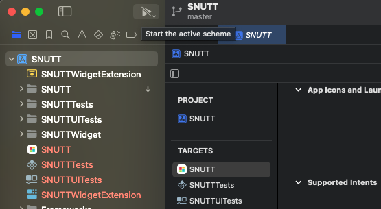

# friends

친구기능 rn 레포지토리

<br/><br/>

## Infrastructure

- configs API를 통해 버전 정보가 클라에 내려갑니다.
- S3으로 정적배포됩니다. 번들과 이미지에셋이 별도로 배포됩니다.

<br/>

## Local Development

### 로컬 셋업

`apps/friends-react-native/.env.local` 을 아래와 같이 설정합니다.

```env
API_URL=https://snutt-api-dev.wafflestudio.com
ASSET_URL=http://localhost:8082
```

그런 다음 터미널 두 개를 열어 각각 js번들과 에셋 서빙 서버를 시작합니다.

```bash
yarn workspace friends-react-native start # js번들 서빙
yarn workspace friends-react-native start:assets # 에셋 정적서빙
```

### Android

로컬 개발은 불가능합니다. TBD

### iOS

Mac OS 개발환경이어야 합니다.

1. 적당한 폴더에 [snutt-ios](https://github.com/wafflestudio/snutt-ios)를 클론받습니다.
1. Finder 에서 `SNUTT-2022/SNUTT.xcodeproj` 파일을 더블클릭해서 Xcode로 열어주세요.
   - Xcode가 설치되어 있어야 합니다. 15.4 버전에서 개발하고 있었습니다.
1. [이 PR](https://github.com/wafflestudio/snutt-ios/pull/237)에 가이드가 있는데,
   - [PR에 있는 가이드 영상](https://github.com/wafflestudio/snutt-ios/assets/33917774/141bfb6f-a512-466d-8209-1dbec744b8a5)에 따라 `ReactNativeDevKit`을 설치하고 `ReactNativeKit`을 제거합니다.
   - PR에 따라 `SNUTT-2022/SNUTT/Views/Scenes/FriendsScene.swift` 파일에서 bundleUrl 로 되어 있는 것을 주석처리하고 원래 주석처리되어 있던 걸 해제하여 로컬 번들을 보도록 변경합니다.
1. 아래 이미지에 보이는 시작 버튼을 눌러 iOS 데브 앱을 실행합니다.
   - 
1. 에뮬레이터에서 친구탭으로 진입합니다.
